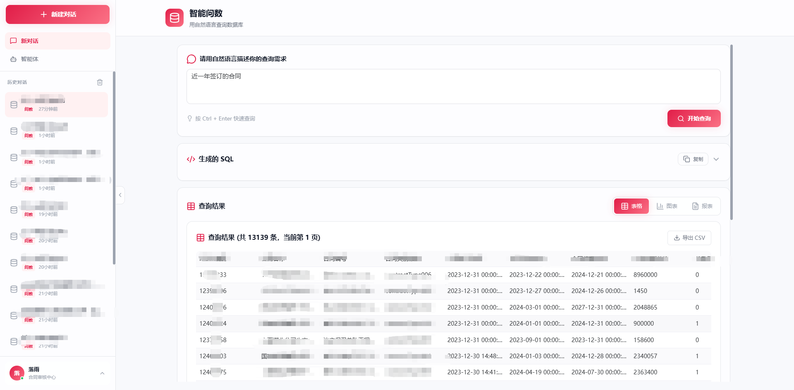
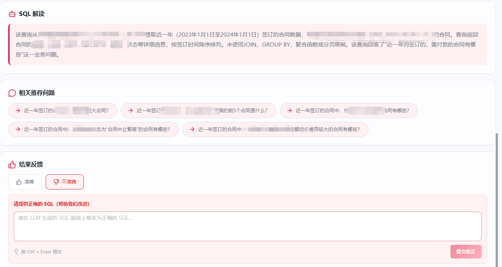
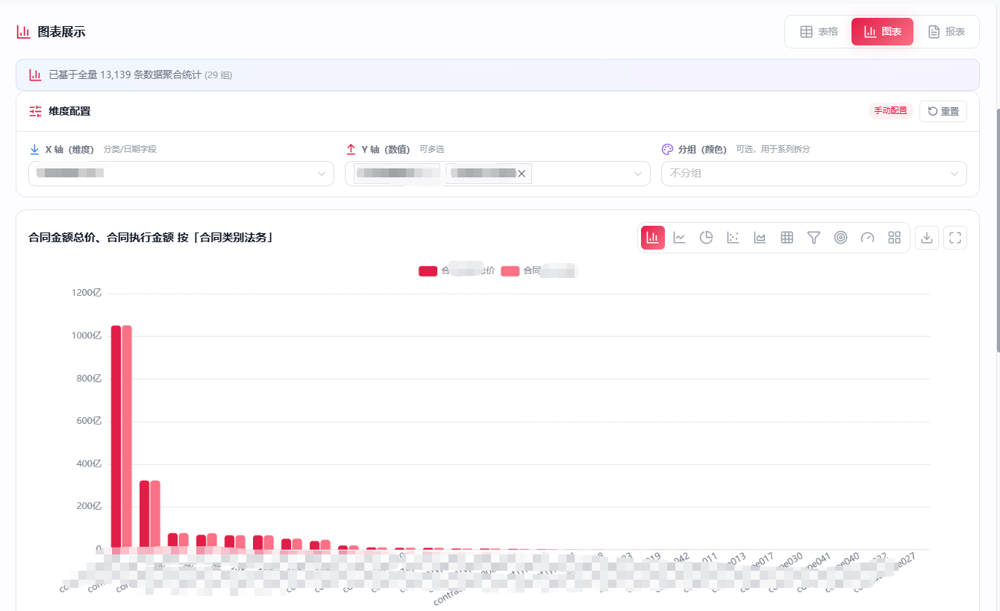
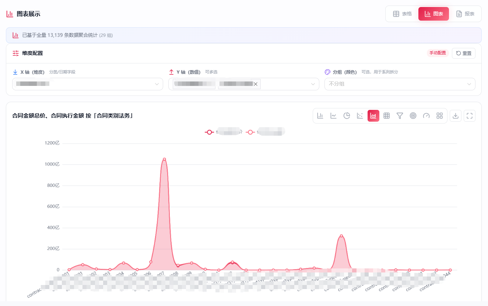
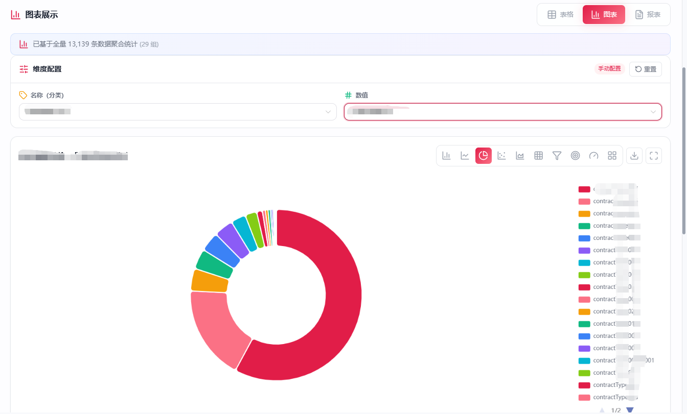
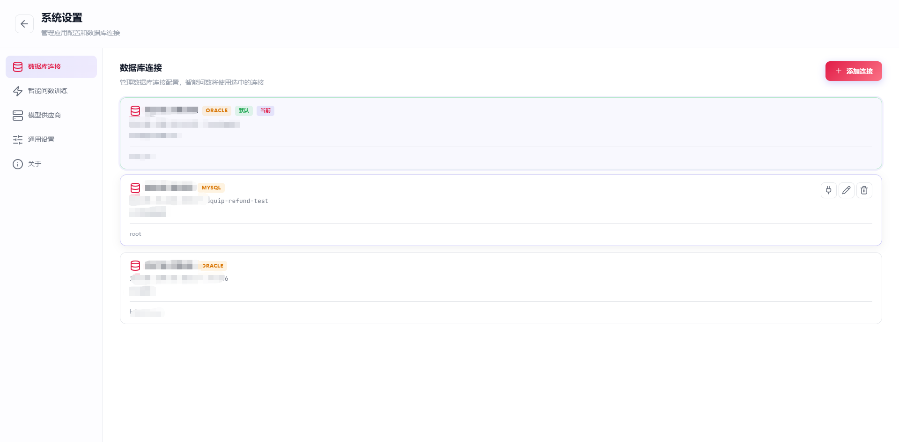
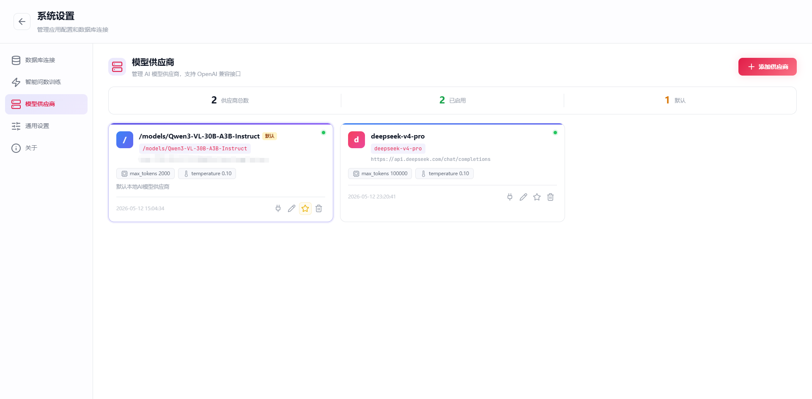
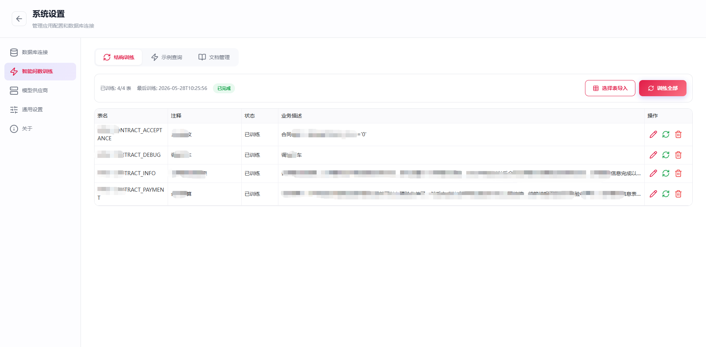
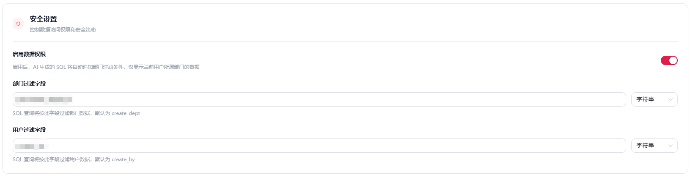
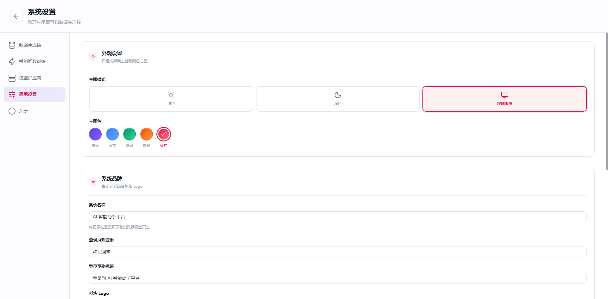

<text_never_used_51bce0c785ca2f68081bfa7d91973934>

  
# 🤖 智能问数 - AI自然语言数据分析平台
### 无需写SQL，用中文提问即可查询企业数据，自动生成可视化报表

[功能介绍](#功能特性) | [应用场景](#应用场景) | [产品截图](#产品截图) | [咨询下单](#咨询合作)

---

## ✨ 产品核心优势
- **零代码查询**：无需掌握SQL，用自然语言提问即可获取想要的数据
- **多数据源支持**：完美对接MySQL、PostgreSQL、ClickHouse、Oracle、Excel、CSV等多种数据源
- **智能可视化**：自动识别数据类型，生成最合适的图表展示（折线图、柱状图、饼图、仪表盘、表格等）
- **企业级安全**：支持细粒度权限管控、敏感数据脱敏、操作审计日志，全面保障数据安全
- **高准确率**：基于国内大模型深度微调，SQL生成准确率高达98%+，支持复杂多表关联查询
- **低门槛部署**：支持SaaS模式快速开箱即用，也支持私有化部署到企业内部服务器

## 🖼️ 产品截图
### 智能查询主界面

### 自然语言转SQL演示

### 可视化报表展示

*支持折线图、柱状图、饼图、仪表盘等多种图表类型自动生成*

*支持多维度数据交叉分析、明细数据钻取、数据对比分析*

*支持图表联动筛选、时间范围选择、自定义指标计算等交互功能*

### 数据源管理界面

### 模型供应商

*支持国内、国外主流及私有化部署模型*

### 智能问数训练

### 数据权限设置

### 其他

## 🎯 适用行业场景
| 行业 | 典型应用场景 |
|------|----------|
| 零售电商 | 销售数据分析、用户行为分析、库存查询、订单统计、转化率分析 |
| 金融保险 | 业绩统计分析、风险控制分析、客户画像查询、保费收入统计 |
| 医疗健康 | 就诊数据分析、药品库存查询、运营报表生成、医疗质量分析 |
| 制造业 | 生产数据监控、产品质量分析、设备运维查询、供应链数据分析 |
| 互联网 | 用户增长分析、产品运营数据、流量来源分析、用户留存分析 |
| 教育培训 | 学员数据分析、课程销售统计、教学质量分析、运营报表生成 |

## 🚀 核心功能特性
✅ 自然语言直接转SQL查询  
✅ 自动生成可视化报表和仪表盘  
✅ 多数据源统一管理和查询  
✅ 自定义可拖拽数据看板  
✅ 定时报表自动推送（邮件/企业微信/钉钉）  
✅ 团队协作和细粒度权限管理  
✅ 完美适配PC端和移动端  
✅ 数据多格式导出（Excel/CSV/PDF/图片）  
✅ 历史查询记录和常用问题保存  
✅ 智能推荐查询维度和指标

## 💰 服务方案
| 版本 | 价格 | 适用场景 |
|------|------|----------|
| SaaS | 按token模式收费 | 中小团队，10个以内用户，支持3个数据源 |
| 私有化部署版 | 面议 | 大型企业/政府单位，定制化需求，独立部署 |
| 提供源码版 | 4890 | 特殊行业定制功能，提供源码，可以二次开发 |

## 📞 咨询合作
### 微信/电话：17795079784
> 扫码添加微信，获取免费演示、定制方案报价
> 
>  <!-- 请将你的微信二维码图片放到screenshots目录下 -->

### 我们提供的服务
- 🕒 7x12小时专属技术支持
- 📦 免费远程安装部署服务
- 📚 一对一操作使用培训
- 🔄 终身免费版本更新迭代
- 🎯 定制化功能开发服务

---

## ⭐ 支持我们
如果这个产品对你有帮助，欢迎点个Star支持一下，你的支持是我们持续优化的最大动力！

---

### 🔍 搜索关键词
`智能问数` `自然语言转SQL` `AI数据分析` `零代码查询` `数据可视化` `报表生成` `企业级数据分析` `SQL自动生成` `中文数据查询` `智能报表` `自助分析` `商业智能` `BI工具` `数据查询平台`